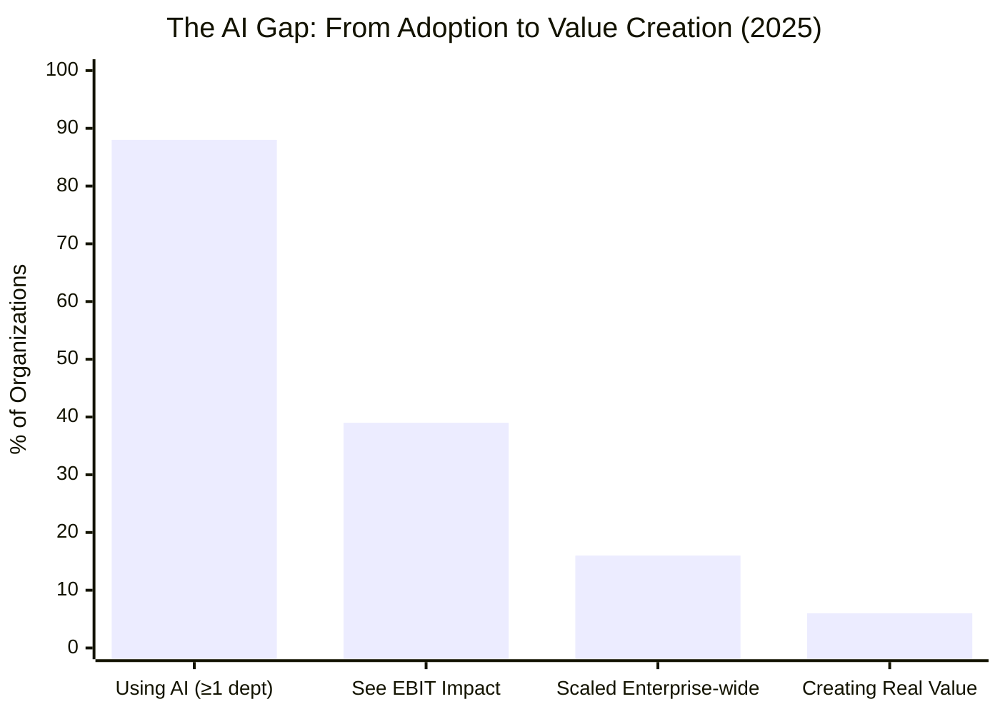
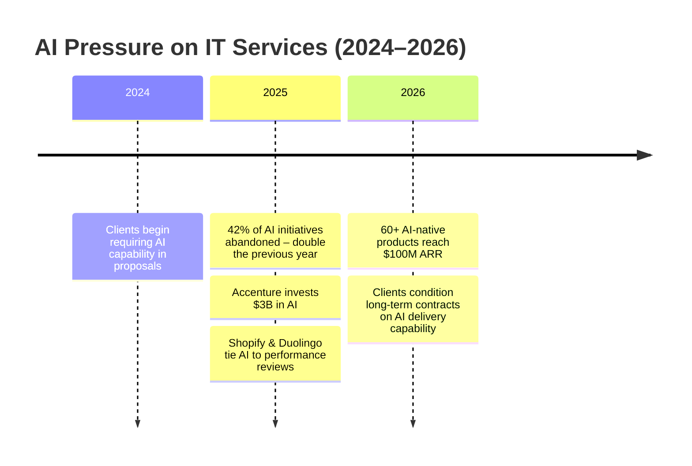
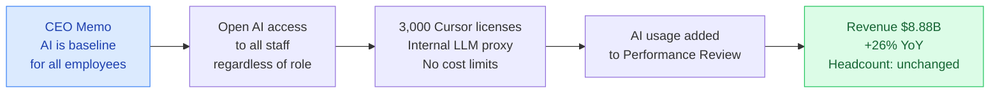
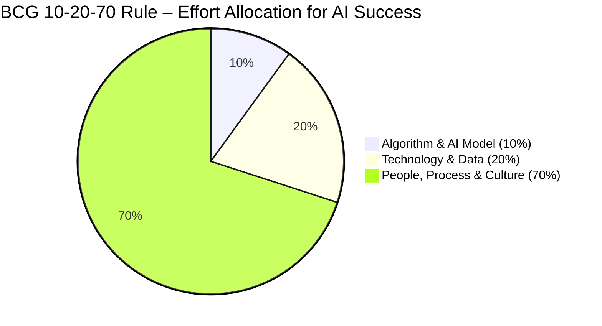
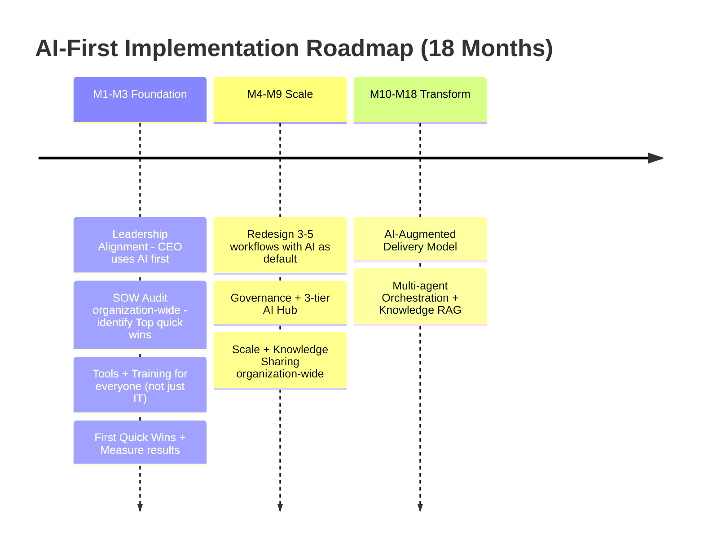

<!-- COVER PAGE -->

# AI-First Company
## From Mindset to Execution

**Why AI-First Thinking Determines the Success or Failure of Every AI Strategy**

Nick Nguyen | A TechNomad
March 2026 – Version 2.0

---

<!-- TABLE OF CONTENTS -->

## Table of Contents

1. [Reality Check: AI Everywhere, Value Nowhere](#1-reality-check-ai-everywhere-value-nowhere)
2. [How They Did It – 3 Case Studies](#2-how-they-did-it--3-case-studies)
3. [Why Some Companies Fail, Why Some Companies Succeed](#3-why-some-companies-fail-why-some-companies-succeed)
4. [What Is AI-First](#4-what-is-ai-first)
5. [Measuring AI Maturity](#5-measuring-ai-maturity)
6. [Concrete Implementation: From Strategy to Action](#6-concrete-implementation-from-strategy-to-action)
7. [Conclusion: AI-First – Not a Choice, but a Condition for Survival](#7-conclusion-ai-first--not-a-choice-but-a-condition-for-survival)

Appendix: References

---

<!-- OVERVIEW -->

## Overview

88% of organizations globally are using AI in at least one business unit. Yet only 5–6% create real value at enterprise scale. More than 80% of AI projects fail to meet initial expectations – a finding consistent across multiple independent studies [1][3]. 42% of AI initiatives were abandoned in 2025 – double the rate of the previous year [9].

The problem is not the technology. AI is already capable enough. The problem lies in **mindset** – how organizations approach, deploy, and operate AI.

This paper analyzes data from McKinsey, BCG, PwC, Gartner, and a range of real-world case studies to answer three questions:

1. **Why do most AI projects fail?** – Not because AI isn't good enough, but because organizations aren't ready to absorb it
2. **What is AI-First mindset and why does it determine success?** – Shifting from "adding AI to old processes" to "designing everything with AI as the default"
3. **How to implement it?** – A concrete framework from SOW Audit to implementation roadmap, measurement, and scale

**For**: CEOs, CTOs, IT Directors, Team Leads, and anyone responsible for bringing AI into their organization.

*88% of companies are using AI — but only 5–6% are creating real value. The gap is growing. Source: McKinsey 2024.*

---

## 1. Reality Check: AI Everywhere, Value Nowhere

### 1.1. The Numbers Don't Lie

This is no longer a distant future scenario. AI is reshaping how organizations operate, compete, and create value right now.

According to McKinsey's State of AI 2025 survey of nearly 2,000 global organizations, 88% of businesses are using AI in at least one department, up from 78% the previous year [1]. But the striking figure lies elsewhere: only 39% see real EBIT impact, and nearly two-thirds are still stuck in the pilot or experimental phase.

BCG presents an even more sobering number: 60% of businesses – the "laggards" – have yet to generate real value from their AI investments. Only about 5% of organizations – what BCG calls "future-built" – are genuinely creating AI value at scale [2].

| Metric | Figure | Source |
|--------|--------|--------|
| Organizations using AI | 88% | McKinsey, 2025 |
| Creating real value | 5–6% | McKinsey & BCG, 2025 |
| AI projects not meeting expectations | ~80% | Gartner & McKinsey (aggregate) [1][3] |
| Organizations yet to create real value from AI investment (laggards) | 60% | BCG, 2025 [2] |
| AI initiatives abandoned (2025) | 42% – double 2024 | S&P Global [9] |
| AI initiatives scaled enterprise-wide | Only 16% | IBM CEO Study, 2025 [10] |
| GenAI projects abandoned after POC | 30% | Gartner, 2024 [11] |

*Chart 1: AI Adoption vs. Value Creation Gap (McKinsey & BCG, 2025)*

### 1.2. So Where Does the Problem Lie?

Many organizations fall into **"pilot purgatory"** – endlessly piloting without scaling. IBM reports that only 16% of AI initiatives are scaled enterprise-wide [10]. But looking more carefully, the problem is not the technology – it's how organizations approach AI.

The barriers below are real obstacles organizations face – not theory, but documented through surveys and real-world deployments:

| Pain Point | Specific Manifestation | Consequence |
|-----------|------------------------|------------|
| **AI Capability Gap** | Same task: one person takes 2 hours, another takes 20 minutes with AI | Team velocity uneven, hard to estimate |
| **Role-based Gap** | Developers use AI more than BA/PM/QA – no standard workflow per role | AI benefits unevenly distributed |
| **Client Pressure** | Clients condition contract renewal on AI productivity proof | Risk of losing contracts without demonstrating AI capability |
| **Data Not Ready** | 60% of AI projects lack "AI-ready data" and will be cancelled by 2026 [3] | Pilot purgatory persists |
| **AI Washing** | Buying Copilot/ChatGPT Enterprise licenses, leaving them unused, reporting adoption | Wasted budget, no real value |
| **No Knowledge Retention** | Good prompts, effective workflows sit on personal machines, never shared | Every person starts from scratch, no compounding effect |
| **No Governance** | No AI management framework | Risk of data breach, compliance failure, ethical issues |

Looking at the table above, most barriers have nothing to do with technology. AI is already good enough. The problem lies in people, processes, and organizational culture.

### 1.3. What You Gain by Acting, What You Lose by Waiting

While most organizations are treading water, a wave of AI-native companies is surging. According to Sapphire Ventures, at least 60 AI-native products have reached $100M ARR, with at least 50 AI-native businesses projected to reach $250M ARR by end of 2026 [4b]. These companies don't use AI as an add-on – they were built around AI from day one.

On the other side, organizations that don't act are losing ground:

- **Losing deals**: Clients ask "How does your team use AI in delivery?" No answer = eliminated in the proposal round
- **Losing talent**: Top performers want to work where AI investment exists, not where manual copy-paste still dominates
- **Losing competitive edge**: Competitors deliver faster, cheaper, and with higher quality through AI

Leading CEOs have sent clear signals. Tobi Lütke (Shopify) requires every team to prove AI can't do the job before hiring more people. Duolingo has built AI usage into performance reviews [5]. This isn't a trend that's coming – it's already here.

### 1.4. For Technology and IT Services Companies – Double Pressure

Technology and IT Services companies face a particular kind of pressure: AI isn't just changing how they **operate internally** – it's changing the very **products and services** they sell.

The global IT Services market is estimated to reach $1.65 trillion in 2026 [6]. Major players have placed explicit bets: Accenture investing $3 billion in AI [12], TCS with a $1.5 billion AI pipeline and over 580 engagements [13]. In this context, organizations that don't transform don't just lose deals – they lose relevance in their clients' eyes.

### 1.5. A Different Approach Is Needed

All of the above – capability gap, pilot purgatory, AI washing, lack of governance – share a common root: organizations are trying to **bolt AI onto old ways of working** rather than changing how they think from the ground up.

This is precisely why the concept of **AI-First Mindset** emerged – not as a technical tool or framework, but as a philosophy: placing AI as the starting point of every process, rather than adding it at the end. The most successful organizations aren't the ones with the best AI technology – they're the ones willing to **redesign how work gets done** with AI as the default.

But before diving into what AI-First Mindset is and how to implement it, let's look at three organizations that tried – with three different approaches and three very different outcomes.

*Chart 2: AI Pressure Points on IT Services (2024–2026)*

---

## 2. How They Did It – 3 Case Studies

To better understand the difference between success and failure, let's look at three companies that implemented AI-First with completely different approaches – and results to match.

### Case Study 1: Shopify – AI-First Without Cutting People

**Background**: Global e-commerce platform, thousands of employees worldwide.

**Approach**:
- CEO Tobi Lütke issued an internal memo: "Reflexive AI usage is now a baseline expectation at Shopify" [5]
- **Before hiring anyone new**, every team must prove AI can't do the job
- Provided AI tools to **all employees** – regardless of technical or non-technical role
- 3,000 Cursor licenses, no cost limits on AI
- Internal LLM proxy for access to the latest models
- AI usage built into **performance reviews**

**Results**:
- Revenue of $8.88B (+26% YoY) with the same headcount
- The teams using AI most: **support and revenue teams** – not engineering
- Significant increase in revenue per employee

**Lesson**: AI-First doesn't require cutting people. Equip everyone, measure output, let top performers multiply their value.

*Chart 3: Shopify AI-First Journey – From CEO Memo to Results*

### Case Study 2: Klarna – AI-First Too Far, Too Fast

**Background**: Fintech, ~5,000 employees, pioneered AI customer service.

**Approach**:
- Deployed AI to handle 2/3 of customer service
- Cut ~40% of the workforce (from ~5,000 to ~3,400 through natural attrition)
- AI handled the equivalent of 700 full-time employees
- Revenue per employee doubled

**Problems That Emerged**:
- Support quality declined – AI couldn't handle complex cases requiring empathy
- After the wave of cuts, Klarna had to **re-hire** people for roles requiring human touch
- Brand reputation suffered
- An expensive lesson in **AI-First ≠ AI-Only**

**Lesson**: Optimizing productivity at the cost of quality is a short-term play. The goal is the **optimal human-AI ratio** for each type of work – where AI participates as much as possible while quality is maintained or improved.

### Case Study 3: Duolingo – AI-First Culture Done Gradually and Sustainably

**Background**: EdTech, language learning platform, ~800 employees.

**Approach**:
- Created **"F-r-AI-days"**: every Friday, employees spend time experimenting with AI
- No compulsion, no scoring
- CEO clearly stated the goal: "Every person can do more"
- AI usage woven naturally into performance reviews
- Only hired when team proved they couldn't automate further

**Results**:
- Employees voluntarily experimented, no resistance
- AI integrated into workflows naturally, without forcing
- Content creation speed significantly improved
- Employees felt empowered, not threatened

**Lesson**: Allow people to experiment safely → natural adoption. No need for top-down pressure if you create an environment that encourages it.

*Note: Duolingo has not published detailed revenue or headcount figures like Shopify/Klarna. The value of this case study lies in the approach – how to build an AI culture without triggering resistance.*

### Comparing the 3 Approaches

| Criterion | Shopify | Klarna | Duolingo |
|-----------|---------|--------|----------|
| Approach | Equip everyone | Replace quickly | Gradual culture |
| Headcount | Unchanged | Cut ~40% → rehired | Unchanged |
| AI Tools | Open to all | Focused on CS | Encourage experimentation |
| Culture | Top-down mandate | Top-down mandate | Bottom-up + top-down |
| Outcome | Revenue up, people retained | Revenue up, quality down | Natural adoption |
| Sustainable? | ✅ High | ⚠️ Required correction | ✅ High |

---

## 3. Why Some Companies Fail, Why Some Companies Succeed

The three case studies above show: the same AI-First label, very different outcomes. What are the universal rules? Data from Gartner (432 respondents, Q4/2024), McKinsey, and Deloitte reveals 7 recurring failure patterns – and 5 clear success patterns.

### 3.1. Seven Most Common Reasons for Failure

| # | Reason for Failure | Frequency | Source |
|---|--------------------|-----------|--------|
| 1 | **No clear business objective** – chasing trends, no KPIs | Very high | McKinsey, CIO.com |
| 2 | **Data not ready** – fragmented, non-standardized, no governance | Very high | Gartner, Lumen |
| 3 | **Unrealistic expectations** – treating AI as "plug-and-play", underestimating operating costs | High | Stanford, Bernard Marr |
| 4 | **Organizational resistance** – employees fear job loss, lack training, no AI literacy | High | Deloitte, Hortonworks |
| 5 | **No governance** – no management framework → security, ethics risks | High | Gartner, Qualys |
| 6 | **Pilot purgatory** – endless piloting without scaling, no connection to real business needs | Medium | S&P Global, CIO.com |
| 7 | **Ignoring the human factor** – focus only on technology, forget change management | Medium | BCG, Deloitte |

BCG presents the **10-20-70 rule**: 10% of effort for algorithms, 20% for technology and data, and **70% for people and processes** – including change management, role redesign, training, and workflow redesign [2]. Most failures live in that final 70%.

*Chart 4: BCG 10-20-70 Rule – Most AI Effort Must Go Into People & Process*

### 3.2. Patterns of Successful Organizations

McKinsey research identifies 12 best practices used by leading organizations. Synthesized, there are 5 core patterns:

**Pattern 1: Strategy before technology**
Successful organizations start with "What business problem does AI solve?" – not "Which AI model should we use?" Every initiative is tied to specific KPIs from the outset.

**Pattern 2: Leadership leads by example**
CEOs and C-level executives use AI daily themselves, rather than delegating to IT to "implement it for them." Shopify and Duolingo both have CEOs who personally use AI and share results.

**Pattern 3: Invest in people, not just tools**
BCG shows that 70% of AI value comes from the "people component" – upskilling, change management, role redesign. "Future-built" companies plan to upskill >50% of their workforce [2].

**Pattern 4: Governance is an enabler, not a barrier**
According to Accenture research (analyzing over 2,000 projects), organizations with responsible AI governance are estimated to create AI value **2.7x more** than those without [7].

**Pattern 5: Start small, scale fast**
Quick wins → prove value → expand. Never try a "big bang" transformation.

### 3.3. The Single Common Denominator

Regardless of the framework used – Gartner's 7 pillars, McKinsey's 12 best practices, or BCG's 10-20-70 – all point to one conclusion: **people and processes determine success, not algorithms or models**.

And that's exactly why the next chapter focuses on the most important thing before any discussion of tools or roadmaps: mindset.

---

### 3.4. Mindset Before Technology

The first three chapters have painted a clear but uncomfortable picture:

- 88% of businesses use AI → yet more than 80% of AI projects fail to meet expectations
- Successful companies invest 70% of effort in people, not technology
- 65% of organizations acknowledge their culture needs to change because of AI (Deloitte, 2026) [8]
- Shopify succeeded not because their tools were better than Klarna's – but because of a different **mindset**: AI as a baseline, not a replacement

In other words: AI technology has been ready for a long time. What isn't ready is the organization. And what determines whether an organization is ready is mindset.

**No AI strategy can succeed without AI-First mindset.** You cannot "bolt AI onto" the old organization and expect new results. The thinking must change first – then the doing can follow.

The next section will define exactly what AI-First mindset is, how it differs from simply "using more AI," and how to know where your organization currently stands.

*Not a technology gap — a mindset gap. AI-First Mindset is the bridge.*

---

## 4. What Is AI-First
### 4.1. Definition
AI-First (or AI-First Mindset) is a work philosophy in which AI is considered the **first step** – not an add-on – before beginning any task. Instead of asking "Should I use AI?", someone with an AI-First mindset defaults to asking "What part of this can AI handle?"

The core difference lies in the opening question:

| Old Thinking | AI-First |
|-------------|----------|
| "How can AI help within our current workflow?" | "If we redesigned this workflow from scratch with AI, what would it look like?" |

PwC emphasizes in its 2026 AI Predictions: rather than cutting a few steps from an old process, think about redesigning the entire workflow – AI-First can turn many steps into a single step [4].

### 4.2. What AI-First Does NOT Mean
- **Replacing humans**: AI amplifies capability, it doesn't replace thinking. Developer + AI > outstanding developer alone. Klarna proved it: replace 50% of staff → have to rehire
- **Using AI blindly for everything**: Knowing when NOT to use AI is also an important skill
- **Just adding a new tool**: AI-First is about changing how you think about processes, not just installing another app
- **One-time learning**: AI tooling evolves fast – AI-First requires continuous updating

The goal is finding the **optimal human-AI ratio** for each type of work – where AI participates as much as possible while quality is maintained or improved.

### 4.3. Five Core Principles of AI-First Mindset
| Principle | Meaning | Applied in Practice |
|-----------|---------|---------------------|
| **AI first, refine after** | Always let AI create the first draft; humans review and improve | Write requirements → AI creates user stories → BA refines |
| **Context is your weapon** | AI is only as smart as the context you provide. Poor prompt = poor output | Provide role, goal, constraints, examples when prompting |
| **Iterate fast** | AI enables testing many approaches in a short time | Generate 3 design options in 10 minutes, choose 1 to refine |
| **Measure output** | Not just using AI, but tracking how much AI actually helps | Log time spent before/after using AI for each task type |
| **Share learnings** | Good prompts and effective workflows must be shared team-wide | Contribute to the team's Shared Prompt Library |

### 4.4. Four Levels of AI Adoption
Framework synthesized from BCG, PwC, and real-world deployment experience:

| Level | Description | Example | % of Organizations |
|-------|-------------|---------|-------------------|
| **AI-Enabled** | AI as a support tool, no workflow change | ChatGPT drafts emails, summarizes meetings | ~50–60% |
| **AI-Enhanced** | Deeper AI integration, optimizing specific steps | Copilot reviews code, AI agent handles L1 support | ~25–30% |
| **AI-First** | Every process redesigned with AI as the default | Klarna: AI handles 2/3 of CS. Shopify: AI is baseline | ~8% |
| **AI-Native** | Organization built around AI from inception. Humans as oversight | Midjourney, Perplexity, Cursor | ~5–6% |

Detailed comparison across dimensions:

| Characteristic | AI-Enabled | AI-Enhanced | AI-First | AI-Native |
|---------------|-----------|------------|---------|----------|
| Core design | Legacy systems | Individual habits | Organizational strategy | AI-first principles |
| Operating mechanism | Add-on features | Tool leverage | Process redesign | Self-adapting |
| Human role | Primary user | Controller | System coordinator | Strategic oversight |
| ROI objective | Task efficiency | Bottleneck removal | Long-term competitive advantage | Business model reinvention |
| Data infrastructure | Fragmented | Flexible | Unified (Centralized) | Intelligent (Autonomous) |

Most organizations are at AI-Enabled but think they've "adopted AI." The gap from AI-Enabled to AI-First isn't about adding tools – it's about changing how you think about work.

### 4.5. Two Dimensions to Distinguish
One easily confused point: the level of adoption (how AI is used) is different from the level of maturity (how far the organization has progressed). A small company might have an AI-First mindset but be at Level 2 maturity because infrastructure isn't ready. Conversely, a large corporation might be at Level 3 maturity but still only AI-Enabled because they haven't dared to redesign workflows.

### 4.6. Mindset Shift: From "Tool" to "Default"
AI-First requires a change in thinking at every level. But there's a barrier most people don't recognize – call it the **"cognitive trap."**

| Level | From | To |
|-------|------|----|
| **Leadership** | "AI is an IT project" | "AI is a business strategy" |
| **Management** | "Let the team experiment with AI" | "Redesign workflows with AI as the default" |
| **Employees** | "AI is an optional tool" | "AI is a basic skill like writing email" |

Management has usually spent months experimenting with AI on their own, so everything seems simple to them. But employees don't have that experience yet – they feel overwhelmed or fear losing their jobs. This cognitive gap is why many AI-First programs fail early: leadership pushes top-down while forgetting the team isn't ready. The solution isn't to push harder, but to break the process down – start with extremely simple tasks to build confidence gradually.

Understanding what AI-First is represents only half the equation. The other half is knowing exactly where your organization stands – and how to measure it.

*All 3 levels must transform together: Employees → AI Practitioner, Management → Workflow Designer, Leadership → AI-First Strategist.*

---

## 5. Measuring AI Maturity
### 5.1. AI Maturity Framework – 5 Levels
Knowing where you are is the first step to moving in the right direction. The framework below synthesizes Gartner, McKinsey, and BCG, adapted for Southeast Asian contexts:

| Level | Name | Description | % of Organizations | Identifying Signs |
|-------|------|-------------|-------------------|-------------------|
| 1 | **Exploring** | Starting to investigate; a few individuals trying AI | ~30% | ChatGPT used personally, no strategy |
| 2 | **Piloting** | Piloting in 1–2 teams | ~35% | POC exists, no ROI measurement |
| 3 | **Scaling** | AI operating across multiple departments | ~20% | AI in production, has policy |
| 4 | **Transforming** | AI changing how the organization operates | ~8% | Redesigned workflows, AI-augmented delivery |
| 5 | **AI-Native** | Organization built around AI from inception | ~5–6% | AI is core, not add-on |

### 5.2. Assessment Across 5 Pillars
To know exactly which level you're at, self-assess across 5 dimensions:

| Pillar | Level 1–2 | Level 3 | Level 4–5 |
|--------|-----------|---------|-----------|
| **Strategy** | No AI strategy | AI strategy tied to KPIs | AI is core business strategy |
| **Data** | Fragmented, non-standardized | Data pipeline, basic governance | Enterprise-wide data platform |
| **Technology** | Using SaaS AI tools | MLOps pipeline, self-hosted options | Scalable AI platform, custom models |
| **Talent** | A few people trying AI | AI training for core teams | All employees AI-literate |
| **Governance** | No AI policy | Policy exists, responsible AI | Audit trail, compliance, ethics board |

Beyond organizational assessment, **individual capability** must also be assessed. Employees should transition through 3 levels over 3–6 months:

| Level | Name | Description |
|-------|------|-------------|
| 1 | **Awareness** | Understands AI-First vision; knows when to use (and not use) AI |
| 2 | **Usage** | Uses AI tools daily; has a personal prompt library |
| 3 | **Ownership** | Independently designs AI workflows; trains colleagues |

### 5.3. Measuring AI Effectiveness
AI measurement should not start with complex financial metrics. A more practical approach is to measure in 3 layers, from simple to advanced:

**Layer 1 – Scope of Application:** Of all tasks, what percentage can AI be applied to?

**Layer 2 – Degree of AI Participation:** For each task where AI is applied, what percentage can AI handle?

**Layer 3 – Effort Reduction:** After each deployment phase, how much has actual effort decreased?

Sample walkthrough for a BA team:

| Task | AI Applicable? | % AI Handles | Effort Before | Effort After | Reduction |
|------|---------------|-------------|---------------|-------------|-----------|
| Writing requirement docs | ✅ | 70% | 8h | 2.5h | –69% |
| Creating test scenarios | ✅ | 80% | 4h | 1h | –75% |
| Stakeholder meetings | ✅ | 30% (summaries) | 6h | 5h | –17% |
| Data analysis | ✅ | 60% | 5h | 2h | –60% |
| Client negotiation | ❌ | 0% | 4h | 4h | 0% |
| **Total** | **4/5 = 80%** | **Avg ~48%** | **27h** | **14.5h** | **–46%** |

This approach has 3 advantages: (1) Anyone can self-measure today using a SOW Audit, (2) No complex baseline needed – just list and categorize, (3) Improvement can be tracked across each phase.

**Role-based supplementary metrics (IT Services example):**

| Role | KPI | Phase 1 Target | Phase 3 Target |
|------|-----|---------------|----------------|
| **Developer** | % code generated/reviewed by AI | 30% | 50% |
| **BA** | % documentation AI-generated | 50% | 80% |
| **QA** | % test cases AI-generated | 40% | 60–80% |
| **PM** | % meetings with AI summaries | 80% | 100% |

Important: don't measure only productivity while ignoring quality. Klarna is the classic lesson – increased productivity but decreased quality is not sustainable.

*Self-assessment: plot your organization's position (blue dashed line) to identify improvement priorities across Strategy, Data, Technology, Talent, and Governance.*

---

## 6. Concrete Implementation: From Strategy to Action
Understanding AI-First and knowing where you stand – now the practical question: where to start, what to do first?

### 6.1. SOW Audit – First Step Anyone Can Take
Core philosophy: **process understanding before tool selection**.

Many organizations do the reverse: buy tools first, then figure out how to fit them into workflows. The result: 42% of AI projects abandoned. SOW Audit fixes this by starting with actual work itself.

**3 SOW Audit Questions:**

| Question | Purpose | Output |
|---------|---------|--------|
| 1. What are your tasks? (SOW) | List every daily/weekly task | Complete SOW task list |
| 2. Which tasks can AI participate in? | Classify: AI can do / AI can assist / 100% human | % of tasks where AI applies |
| 3. How much can AI handle for each? | Quantify % AI handles per task | % AI participation + estimated effort reduction |

**Example walkthrough: 5-person BA team**

Rather than complex measurement, simply list tasks and classify – the SOW Audit output is itself the measurement baseline from section 6.3:

| Task | Hours/Week | AI Can Participate? | % AI Handles |
|------|-----------|---------------------|-------------|
| Writing requirement docs | 8h | ✅ | 70% (AI draft, human review) |
| Creating test scenarios | 4h | ✅ | 80% (AI generates, human refines) |
| Stakeholder meetings | 6h | ✅ | 30% (AI summarizes + action items) |
| Data analysis | 5h | ✅ | 60% (AI queries, human interprets) |
| Client negotiation | 4h | ❌ | 0% (100% human) |

**Result**: 4/5 tasks (80%) can use AI; AI handles ~48% on average. This table feeds directly into the 3-layer measurement model from section 6.3 – add "effort before/after" columns to track improvement across phases.

### 6.2. Implementation Roadmap – 3 Phases
| Phase | Name | Duration | Objective |
|-------|------|----------|-----------|
| **Phase 1** | Foundation | W1–W12 | 80% of tasks audited; >50% of employees using AI daily |
| **Phase 2** | Scale | W13–W36 | 3–5 workflows redesigned; AI governance in effect |
| **Phase 3** | Transform | W37–W72 | 40%+ effort reduction on top workflows; AI agents handling 30%+ routine tasks |

#### Phase 1: Foundation (W1–W12)

**W1–W2: Leadership alignment**
- C-level workshop: AI-First mindset, vision, commitments
- CEO/CTO **use AI daily themselves** – don't delegate to IT
- Identify 3–5 business KPIs to tie AI initiatives to
- Clear announcement: AI-First is a strategy, not a project

**W3–W4: Organization-wide SOW Audit**
- Every team/department conducts a SOW Audit
- Aggregate AI Augmentation Rate baseline for the entire organization
- Identify Top 10 quick wins (highest AI augmentation potential)

**W5–W8: Tools + Training**
- Deploy AI tools to all employees (not just IT)
- Basic training: "AI 101 for Everyone" – 2–4 hours/person
- Build internal champion network: 1–2 AI champions per team
- Set up AI usage tracking (not surveillance, but adoption measurement)

**W9–W12: Quick wins + Measure**
- Deploy Top 5 quick wins
- Measure results: time saved, quality maintained?
- Share results internally (all-hands, Slack, newsletter)
- Adjust based on feedback

#### Phase 2: Scale (W13–W36)

**W13–W20: Workflow redesign**
- Select 3–5 workflows with highest effort reduction from SOW Audit
- Redesign from scratch with AI as default (not "add AI to old workflow")
- Measure effort before/after using the 3-layer model (section 6.3)

**W21–W28: Governance + Infrastructure**
- Build AI governance framework (reference ISO/IEC 42001, NIST AI RMF)
- Responsible AI policy + data security guidelines
- Deploy **3-tier tooling**:
  - **Personal AI**: ChatGPT, GitHub Copilot – individual productivity
  - **Team AI**: Notion AI, Slack AI – collaboration + knowledge sharing
  - **Enterprise AI Hub**: Centralized AI Gateway, prompt library, document generators
- AI Gateway (Portkey, Helicone or equivalent) for security, cost control, analytics

**W29–W36: Scale + Knowledge sharing**
- Advanced training for power users and AI champions
- Build **Shared Prompt Library** + AI workflow templates for the entire organization
- Second measurement round: compare to Phase 1 baseline – how much has effort reduced?

#### Phase 3: Transform (W37–W72)

**W37–W48: Business model impact**
- AI-augmented delivery model – changing how products/services are sold and delivered
- AI capability as competitive advantage in proposals
- Adjust pricing/business model if needed

**W49–W72: Automation + Knowledge system**
- Multi-agent orchestration: AI agents coordinating across departments
- Internal Knowledge Base (RAG) – all coding conventions, successful projects, lessons learned
- Third measurement round: 40%+ effort reduction on top workflows; role-based KPIs hitting targets

*Chart 5: AI-First Implementation Roadmap – 18 Months*

*Note: Adjust start date to your organization's actual timeline. Phase durations can be compressed or extended.*

### 6.3. 3-Tier Strategy: Individual → Team → System
Core philosophy: build **bottom-up**, with individual habits as the nucleus. If the base isn't solid, all efforts to build higher-level systems will fail.

| Tier | Focus | Objective | Example |
|------|-------|-----------|---------|
| **1. Individual** | Mindset & Habits | Every person uses AI daily | Use AI to write emails, summarize documents, brainstorm solutions |
| **2. Team** | Workflows & Boundaries | AI as the "glue" connecting the team | BA doesn't wait for Dev – uses AI to answer immediately. PM auto-generates status reports |
| **3. System** | Organization Self-operation | AI Agents operating autonomously | Centralized knowledge base; AI predicts risks; auto-adjusts resources |

**Why bottom-up matters**: If individuals aren't comfortable with AI, no workflow will run. And if workflows aren't solid, AI agent systems become management bottlenecks.

### 6.4. Training the Mindset – Not the Tool
Common mistake: organizations run "How to Use ChatGPT" training and think they're done. Mindset training is completely different:

| Tool Training | Mindset Training |
|--------------|-----------------|
| "Here's how to use ChatGPT" | "Here's how to rethink your work" |
| 2-hour workshop, done | Continuous, weekly |
| IT trains everyone | Everyone trains each other |
| Focus: features, buttons | Focus: thinking, workflows, application |

**General training framework:**

| Phase | Content | Duration | Audience |
|-------|---------|----------|----------|
| **Awareness** | What is AI-First, why it matters, case studies | 2 hours | Everyone |
| **SOW Audit** | Practice SOW Audit for your own team | 2 hours | Everyone |
| **Hands-on** | Try AI with real tasks, measure results | 2 weeks | Everyone |
| **Deep Dive** | Prompt engineering, workflow design, advanced tools | Ongoing | Champions |
| **Sharing** | Demo results, share internal best practices | Monthly | Everyone |

**Role-based training (for IT Services / Software companies):**

| Role | Focus Shift | Key Topics | Suggested Tools |
|------|------------|------------|----------------|
| **Developer** | From "writing code" → "designing intelligent systems" | Agentic coding, MCP integration, AI-driven code review | Cursor, Copilot, Windsurf |
| **BA** | From "capturing requirements" → "dialoguing with AI to refine them" | AI-powered requirement gathering, transcript → User Stories | Notion AI, ChatGPT, WriteMyPrd |
| **PM** | Free from admin → focus on risk & client | Predictive sprint planning, AI status reporting | Jira AI, ClickUp, Monday.com |
| **QA** | From manual testing → data-driven quality governance | AI test case generation, self-healing automation | Playwright, aqua, AI testing tools |

### 6.5. The Leadership Role – Lead By Example
Data is clear: organizations with strong executive AI sponsorship achieve significantly higher positive ROI rates (McKinsey [1]) and according to Accenture, are estimated to create AI value 2.7x more effectively [7]. 65% of organizations acknowledge their culture needs to change because of AI – and culture always starts at the top [8].

But leadership isn't just issuing mandates – it's modeling behavior. As discussed in the "cognitive trap" section, management must personally experience AI before expecting the team to change. Without creating a safe environment for experimentation, adoption will not happen.

**3 things to do immediately:**

1. **Use AI daily** – when the CEO shares "Today I used AI to..." → stronger signal than any memo
2. **Request AI usage reports** – each team lead reports current AI status monthly
3. **Pick 1 specific workflow** to pilot redesign with AI as the default

### 6.6. Addressing Employee Concerns
**Why employees are concerned:**

| Concern | Reality | How to Address |
|---------|---------|---------------|
| "AI will replace me" | People who know how to use AI replace those who don't – not AI replacing everyone | Klarna had to rehire. Shopify kept headcount + grew revenue |
| "I don't know how to code" | AI's strongest with natural language – just speak English/Vietnamese | Demo: "Summarize this email...", "Write this report in this format..." |
| "AI output isn't accurate" | AI being wrong is normal. AI drafts, humans review. Fixing 5 minutes beats doing 1 hour yourself | Set expectation: AI = draft machine, not final answer |
| "Client won't allow it" | Use freely for internal work. Client-related work → ask first | Create clear "Allowed / Ask First / Never" table |
| "My team lead doesn't care" | Do it first, prove it after. Have data → have a story | Use it yourself, measure results, demo 5 minutes in standup |

**Data security – clear classification table:**

| ✅ Allowed | ❓ Ask First | ❌ Never |
|-----------|------------|---------|
| Write generic code (utilities, algorithms) | Code related to client's business logic | Paste client's product source code into public AI |
| Draft emails, write internal documents | Create test data from client's business description | Paste data with PII (names, emails, phone numbers) |
| Learn new technologies, explain concepts | Use AI to analyze project architecture | Paste credentials, API keys, sensitive configs |
| Summarize internal meeting notes | Use AI for client requirements | Upload NDA documents, contracts, financial data |

*Golden rule: if you're not sure whether it's allowed, ask your team lead or IT first. 5 seconds to ask beats 5 months handling a data breach.*

**Employees will adopt when they see 3 things**: (1) Leadership uses it first, (2) No punishment for trying, (3) Concrete results from colleagues.

### 6.7. Governance & Compliance
To scale AI safely, organizations need:

- **ISO/IEC 42001:2023**: First international standard for AI Management Systems – preparation for EU AI Act
- **NIST AI RMF**: AI Risk Management Framework – Map, Measure, Manage
- **Human-in-the-Loop (HITL)**: "Propose-then-commit" mechanism – AI proposes, humans approve for high-risk tasks
- **IP Ownership**: Clear distinction between Customer IP (data, code, fine-tuned models) vs. Background IP (prompt libraries, internal AI workflows)

### 6.8. Common Pitfalls
| Phase | Common Mistake | How to Avoid |
|-------|---------------|-------------|
| Foundation | Buy tools and leave them unused (AI washing). Only IT uses AI | Tie AI to specific KPIs. Open access to everyone |
| Scale | Try to scale too fast without governance | AI policy before scaling. Responsible AI framework |
| Transform | Fully replace humans where empathy is needed | Hybrid model: AI for routine, humans for complex/emotional |

---

## 7. Conclusion: AI-First – Not a Choice, but a Condition for Survival
Data from McKinsey, BCG, PwC, and the range of case studies in this paper paint a clear picture: **the 5–6% of leading organizations are pulling away from the remaining 94%** – and this gap will only widen. This is not a temporary trend – it is a structural divergence.

### Five Key Points

| # | Key Point |
|---|-----------|
| 1 | **AI-First is a design mindset** – not adding AI to old processes. Ask: "If we redesigned this from scratch with AI, what would it look like?" |
| 2 | **Start with SOW Audit** – list tasks, classify, measure % AI participation. Anyone can do this today |
| 3 | **Top-down + Bottom-up** – leadership leads by example + employees take initiative. Missing either = failure |
| 4 | **AI-First ≠ AI-Only** – Klarna proved: replacing 100% of humans is not the destination |
| 5 | **Measure continuously** – % tasks applying AI → % AI handles → effort reduction per phase |

### Where to Start

**If you're a leader:** Use AI for your own work first, ask every team to report current AI status, and choose 1 workflow to pilot redesign.

**If you're an employee:** Do a SOW Audit for yourself today. Try AI on 3 repetitive daily tasks. Measure time saved. Share results.

The numbers don't lie. Your position in this race doesn't depend on size or budget – it depends on the speed at which you start and the determination to see it through.

---

## Action Checklist – Start Today

| # | Action | Who | When | Done? |
|---|--------|-----|------|-------|
| 1 | Use AI for 3 repetitive daily tasks | Everyone | This week | ⬜ |
| 2 | Do a SOW Audit for yourself (list tasks, classify, measure %) | Everyone | This week | ⬜ |
| 3 | Share SOW Audit results with team | Team lead | Week 2 | ⬜ |
| 4 | Aggregate department SOW Audit, identify Top 5 quick wins | Team lead | Week 3 | ⬜ |
| 5 | Deploy AI tools to everyone (not just IT) | Leadership | Month 1 | ⬜ |
| 6 | Run "AI 101" training – 2–4 hours | HR/Champion | Month 1 | ⬜ |
| 7 | Measure quick win results (effort reduced, quality maintained?) | Team lead | Month 3 | ⬜ |
| 8 | Share results internally (all-hands, newsletter) | Leadership | Month 3 | ⬜ |
| 9 | Redesign 1 workflow with AI as the default | Team lead | Month 4 | ⬜ |
| 10 | Build AI governance policy | Leadership + IT | Month 5 | ⬜ |

---

## References

| # | Source | Details |
|---|--------|---------|
| [1] | McKinsey & Company (2025) | The State of AI in 2025: Agents, Innovation, and Transformation |
| [2] | BCG (2025) | Build for the Future 2025: The Widening AI Value Gap / AI-First Companies Win the Future |
| [3] | Gartner (2025) | AI Maturity Model and AI Roadmap Toolkit. Survey Q4/2024, 432 respondents |
| [4a] | PwC (2026) | 2026 AI Business Predictions |
| [4b] | Sapphire Ventures (2025) | 2026 Outlook: 10 AI Predictions |
| [5] | First Round Review (2025) | From Memo to Movement: Shopify's Cultural Adoption of AI |
| [6] | Mordor Intelligence (2026) | IT Services Market Report |
| [7] | Accenture (2025) | Responsible AI Governance Study – 2,000 projects analyzed |
| [8] | Deloitte (2026) | Global Human Capital Trends 2026 |
| [9] | S&P Global (2025) | AI Initiatives and Enterprise Abandonment Report |
| [10] | IBM (2025) | CEO Study: 2,000 CEOs across 33 countries, Feb–Apr 2025 |
| [11] | Gartner (2024) | Predicts 30% of GenAI Projects Abandoned After POC by End of 2025 |
| [12] | Accenture (2023) | $3B AI Investment Announcement, June 2023 |
| [13] | TCS (2025) | AI & GenAI Pipeline and Business Engagements, FY2025 |

---

© 2026 NickNguyen8. All rights reserved.
Researched and compiled by NickNguyen8 – Delivery Director | Digital Transformation, AI Adoption, Technology Consulting, and Enterprise Setup.
