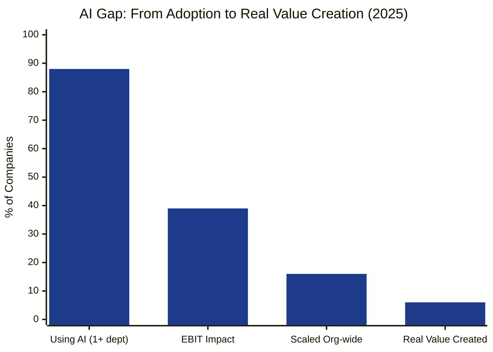
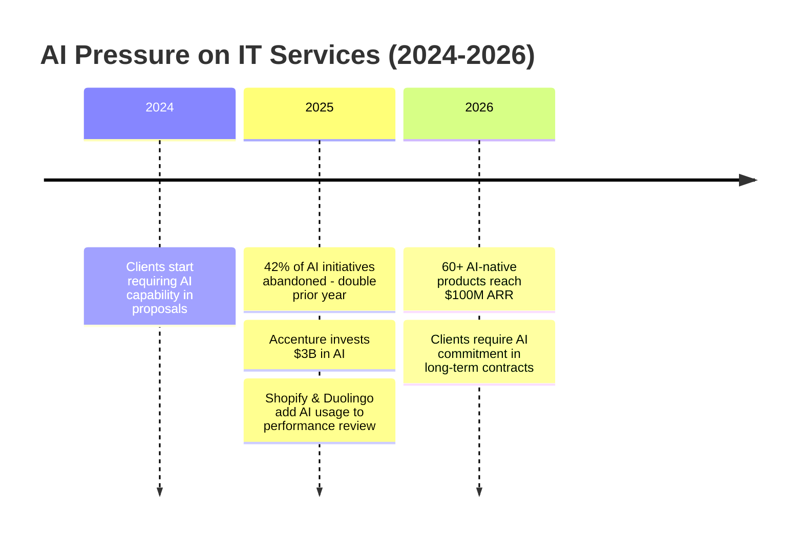
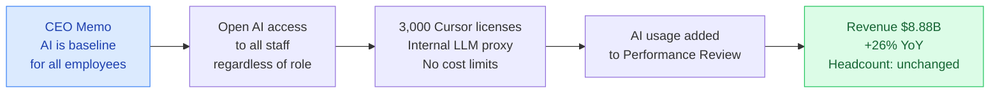
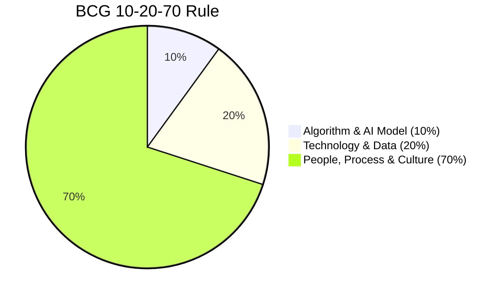
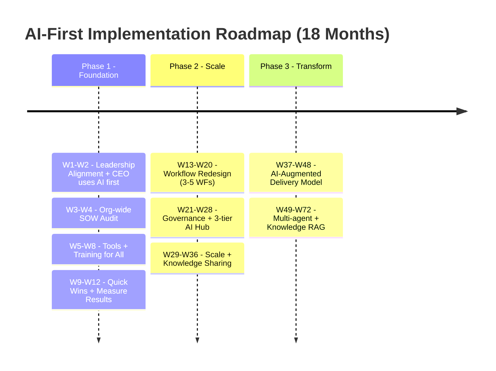

<!-- TRANG BÌA -->

# AI-First Company
## Từ Tư Duy Đến Hành Động

**Tại Sao Tư Duy AI-First Quyết Định Thành Bại Của Mọi Chiến Lược AI**

Nick Nguyen | A TechNomad
Tháng 3, 2026 – Phiên bản 2.0

---

<!-- MỤC LỤC -->

## Mục Lục

1. [Thực Trạng: AI Everywhere, Value Nowhere](#1-thực-trạng-ai-everywhere-value-nowhere)
2. [Họ Đã Làm Như Thế Nào – 3 Nghiên Cứu Điển Hình](#2-họ-đã-làm-như-thế-nào--3-nghiên-cứu-điển-hình)
3. [Tại Sao Có Công Ty Thất Bại, Tại Sao Có Công Ty Thành Công](#3-tại-sao-có-công-ty-thất-bại-tại-sao-có-công-ty-thành-công)
4. [AI-First Là Gì](#4-ai-first-là-gì)
5. [Đo Lường Mức Độ Trưởng Thành AI](#5-đo-lường-mức-độ-trưởng-thành-ai)
6. [Triển Khai Cụ Thể: Từ Chiến Lược Đến Hành Động](#6-triển-khai-cụ-thể-từ-chiến-lược-đến-hành-động)
7. [Kết Luận: AI-First – Không Phải Lựa Chọn, Mà Là Điều Kiện Tồn Tại](#7-kết-luận-ai-first--không-phải-lựa-chọn-mà-là-điều-kiện-tồn-tại)

Phụ Lục: Nguồn Tham Khảo

---

<!-- TỔNG QUAN -->

## Tổng Quan

88% doanh nghiệp toàn cầu đã sử dụng AI trong ít nhất một bộ phận. Nhưng chỉ 5-6% tạo được giá trị thực sự ở quy mô toàn doanh nghiệp. Hơn 80% dự án AI không đạt kỳ vọng ban đầu – tổng hợp từ nhiều nghiên cứu độc lập [1][3]. 42% sáng kiến AI bị hủy bỏ trong năm 2025 – gấp đôi năm trước [9].

Vấn đề không nằm ở công nghệ. AI đã đủ tốt. Vấn đề nằm ở **tư duy** – cách tổ chức tiếp cận, triển khai và vận hành AI.

Bài viết này phân tích dữ liệu từ McKinsey, BCG, PwC, Gartner và hàng loạt case study thực tế để trả lời 3 câu hỏi:

1. **Tại sao phần lớn dự án ứng dụng AI thất bại?** – Không phải vì AI không tốt, mà vì tổ chức không sẵn sàng hấp thụ nó
2. **AI-First mindset là gì và tại sao nó quyết định thành bại?** – Chuyển từ "thêm AI vào quy trình cũ" sang "thiết kế mọi thứ với AI là mặc định"
3. **Triển khai như thế nào?** – Framework cụ thể từ SOW Audit đến implementation roadmap, đo lường và nhân rộng

**Dành cho**: CEO, CTO, IT Director, Team Lead và bất kỳ ai đang chịu trách nhiệm đưa AI vào tổ chức.

*88% doanh nghiệp đã dùng AI — nhưng chỉ 5–6% tạo được giá trị thực. Khoảng cách ngày càng lớn. Nguồn: McKinsey 2024.*

---

## 1. Thực Trạng: AI Everywhere, Value Nowhere

### 1.1. Những con số không nói dối

Không còn là câu chuyện của tương lai xa. AI đang định hình lại cách doanh nghiệp vận hành, cạnh tranh và tạo giá trị ngay lúc này.

Theo khảo sát State of AI 2025 của McKinsey với gần 2.000 tổ chức toàn cầu, 88% doanh nghiệp đã sử dụng AI trong ít nhất một bộ phận, tăng từ 78% năm trước [1]. Nhưng con số đột phá lại nằm ở phía khác: chỉ 39% thấy tác động thực sự lên EBIT, và gần 2/3 vẫn đang mắc kẹt ở giai đoạn thí điểm hoặc thử nghiệm.

BCG còn đưa ra con số đáng báo động: 60% doanh nghiệp – nhóm "laggards" – chưa tạo được giá trị thực tế từ các khoản đầu tư AI. Chỉ khoảng 5% tổ chức được BCG gọi là "future-built" – những đơn vị thực sự tạo giá trị AI ở quy mô [2].

| Chỉ số | Con số | Nguồn |
|--------|--------|-------|
| Doanh nghiệp đã dùng AI | 88% | McKinsey, 2025 |
| Tạo được giá trị thực sự | 5-6% | McKinsey & BCG, 2025 |
| Dự án AI không đạt kỳ vọng ban đầu | ~80% | Gartner & McKinsey (tổng hợp) [1][3] |
| Doanh nghiệp chưa tạo giá trị thực từ đầu tư AI (laggards) | 60% | BCG, 2025 [2] |
| Sáng kiến AI bị hủy bỏ (2025) | 42% – gấp đôi 2024 | S&P Global [9] |
| AI initiatives scale toàn doanh nghiệp | Chỉ 16% | IBM CEO Study, 2025 [10] |
| GenAI projects bị abandon sau POC | 30% | Gartner, 2024 [11] |

*Biểu đồ 1: Khoảng cách AI – từ Adoption đến Value Creation (McKinsey & BCG, 2025)*

### 1.2. Vậy vấn đề nằm ở đâu?

Nhiều tổ chức rơi vào tình trạng **"pilot purgatory"** – thí điểm mãi không scale được. IBM báo cáo chỉ 16% AI initiatives được scale toàn doanh nghiệp [10]. Nhưng nếu nhìn kỹ hơn, vấn đề không phải ở công nghệ mà ở cách tổ chức tiếp cận AI.

Dưới đây là những rào cản thực tế mà các tổ chức đang gặp phải – không phải lý thuyết, mà được ghi nhận từ các khảo sát và triển khai thực tế:

| Pain Point | Biểu hiện cụ thể | Hệ quả |
|-----------|------------------|--------|
| **AI Capability Gap** | Cùng 1 task, có người làm 2 giờ, có người 20 phút nhờ AI | Team velocity không đồng đều, khó estimate |
| **Role-based Gap** | Dev dùng AI nhiều hơn BA/PM/QA – chưa có workflow chuẩn cho từng role | Lợi ích AI không được tận dụng đồng đều |
| **Áp lực khách hàng** | Client đặt điều kiện duy trì hợp đồng với AI productivity | Rủi ro mất hợp đồng nếu không chứng minh được AI capability |
| **Dữ liệu chưa sẵn sàng** | 60% dự án ứng dụng AI thiếu "AI-ready data" sẽ bị hủy đến 2026 [3] | Pilot purgatory kéo dài |
| **AI Washing** | Mua license Copilot, ChatGPT Enterprise rồi để đó, báo cáo cho đẹp | Lãng phí ngân sách, không có value thực |
| **Thiếu Knowledge Retention** | Prompt hay, workflow tốt nằm ở máy cá nhân, không chia sẻ | Mỗi người học lại từ đầu, không có cộng hưởng |
| **Thiếu governance** | Không có framework quản trị AI | Rủi ro data breach, compliance, đạo đức |

Nhìn vào bảng trên, có thể thấy phần lớn rào cản không liên quan đến công nghệ. AI đã đủ tốt. Vấn đề nằm ở con người, quy trình và văn hóa tổ chức.

### 1.3. Được gì nếu làm đúng, mất gì nếu chần chừ

Trong khi phần lớn "dậm chân tại chỗ", một làn sóng công ty AI-native đang bùng nổ. Theo Sapphire Ventures, ít nhất 60 sản phẩm AI-native đã đạt 100 triệu USD ARR, và dự báo cuối 2026 sẽ có ít nhất 50 doanh nghiệp AI-native đạt 250 triệu USD ARR [4b]. Những công ty này không dùng AI như phần thêm – họ được xây dựng quanh AI từ ngày đầu tiên.

Ở chiều ngược lại, tổ chức không hành động đang mất dần lợi thế:

- **Mất deal**: Client hỏi "Team của bạn dùng AI như thế nào trong delivery?", không có câu trả lời = thua ngay vòng proposal
- **Mất người giỏi**: Nhân tài muốn làm việc ở nơi có đầu tư AI, không phải nơi vẫn copy-paste thủ công
- **Mất competitive edge**: Đối thủ deliver nhanh hơn, rẻ hơn, chất lượng hơn nhờ AI

Các CEO hàng đầu đã phát tín hiệu rõ ràng. Tobi Lütke (Shopify) yêu cầu mọi team chứng minh AI không thể làm được trước khi tuyển thêm người. Duolingo đưa AI usage vào performance review [5]. Đây không phải xu hướng sắp đến – nó đang diễn ra.

### 1.4. Với công ty công nghệ và IT Services – áp lực kép

Công ty công nghệ và IT Services chịu áp lực đặc biệt: AI không chỉ thay đổi cách họ **vận hành** nội bộ, mà còn thay đổi chính **sản phẩm** họ bán cho khách hàng.

Thị trường IT Services toàn cầu ước tính đạt 1,65 nghìn tỷ USD năm 2026 [6]. Các ông lớn đã đặt cược rõ ràng: Accenture đầu tư 3 tỷ USD vào AI [12], TCS với pipeline AI trị giá 1,5 tỷ USD và hơn 580 engagements [13]. Trong bối cảnh đó, những đơn vị không chuyển đổi không chỉ mất deal – họ mất luôn relevance trong mắt khách hàng.

### 1.5. Cần một cách tiếp cận khác

Tất cả những vấn đề kể trên – capability gap, pilot purgatory, AI washing, thiếu governance – đều có chung một gốc rễ: tổ chức đang cố **gắn AI vào cách làm cũ** thay vì thay đổi cách nghĩ từ gốc.

Chính vì thế, khái niệm **AI-First Mindset** ra đời – không phải như một công cụ hay framework kỹ thuật, mà như một triết lý tiếp cận: đặt AI làm điểm xuất phát của mọi quy trình, thay vì bổ sung AI vào cuối. Các tổ chức thành công nhất không phải là tổ chức có công nghệ AI tốt nhất, mà là tổ chức dám **thiết kế lại cách làm việc** với AI là mặc định.

Nhưng trước khi đi sâu vào AI-First Mindset là gì và triển khai như thế nào, hãy nhìn vào ba tổ chức đã thử – với ba cách tiếp cận và ba kết quả rất khác nhau.

*Biểu đồ 2: Áp lực AI lên IT Services theo thời gian*

---

## 2. Họ Đã Làm Như Thế Nào – 3 Nghiên Cứu Điển Hình

Để hiểu rõ hơn sự khác biệt giữa thành công và thất bại, hãy nhìn vào ba công ty đã triển khai AI-First với ba cách tiếp cận hoàn toàn khác nhau – và kết quả cũng rất khác nhau.

### Case Study 1: Shopify – AI-First mà không cắt người

**Background**: Nền tảng e-commerce, hàng nghìn nhân viên toàn cầu.

**Cách làm**:
- CEO Tobi Lütke gửi memo nội bộ: "Reflexive AI usage is now a baseline expectation at Shopify" [5]
- **Trước khi tuyển thêm người**, mọi team phải chứng minh AI không thể làm được
- Cung cấp AI tools cho **toàn bộ** nhân viên – không phân biệt kỹ thuật hay phi kỹ thuật
- 3.000 license Cursor, không giới hạn chi phí AI
- LLM proxy nội bộ cho mọi model mới nhất
- Đưa AI usage vào **performance review**

**Kết quả**:
- Doanh thu 8.88 tỷ USD (+26% YoY) với cùng số người
- Nhóm dùng AI nhiều nhất: **support và revenue team** – không phải engineering
- Revenue per employee tăng đáng kể

**Bài học**: AI-First không cần cắt người. Trang bị cho toàn bộ, đo lường output, để người giỏi nhân đôi giá trị.

*Biểu đồ 3: Shopify AI-First Journey – từ CEO memo đến kết quả*

### Case Study 2: Klarna – AI-First nhưng quá xa, quá nhanh

**Background**: Fintech, ~5.000 nhân viên, AI customer service tiên phong.

**Cách làm**:
- Triển khai AI xử lý 2/3 customer service
- Cắt giảm ~40% nhân sự (từ ~5.000 xuống ~3.400 qua natural attrition)
- AI xử lý tương đương 700 nhân viên full-time
- Revenue per employee tăng gấp đôi

**Vấn đề nảy sinh**:
- Chất lượng support giảm – AI không xử lý được case phức tạp cần empathy
- Sau làn sóng cắt giảm, Klarna phải **tuyển lại** người cho các vị trí cần human touch
- Brand reputation bị ảnh hưởng
- Bài học đắt giá về **AI-First ≠ AI-Only**

**Bài học**: Tối ưu productivity mà hy sinh quality là con đường ngắn hạn. Mục tiêu là **optimal human-AI ratio** cho từng loại công việc – nơi AI tham gia nhiều nhất mà quality vẫn đảm bảo hoặc tốt hơn.

### Case Study 3: Duolingo – Văn hoá AI-First từ từ, bền vững

**Background**: EdTech, nền tảng học ngôn ngữ, ~800 nhân viên.

**Cách làm**:
- Tạo chương trình **"F-r-AI-days"**: mỗi thứ Sáu, nhân viên dành thời gian thử nghiệm AI
- Không ép buộc, không chấm điểm
- CEO nói rõ mục tiêu: "Mỗi người làm được nhiều hơn"
- AI usage đưa vào performance review một cách tự nhiên
- Chỉ tuyển thêm khi team chứng minh không thể automate thêm

**Kết quả**:
- Nhân viên tự nguyện thử nghiệm, không kháng cự
- AI tích hợp vào workflow tự nhiên, không gượng ép
- Content creation tốc độ nhanh hơn đáng kể
- Nhân viên cảm thấy được trao quyền, không bị đe dọa

**Bài học**: Cho phép mọi người thử nghiệm an toàn → adoption tự nhiên. Không cần top-down ép buộc nếu tạo được môi trường khuyến khích.

*Lưu ý: Duolingo không công bố số liệu revenue hay headcount chi tiết như Shopify/Klarna. Giá trị của case study này nằm ở approach – cách tạo văn hóa AI mà không gây kháng cự.*

### So sánh 3 approaches

| Tiêu chí | Shopify | Klarna | Duolingo |
|----------|---------|--------|----------|
| Approach | Trang bị toàn bộ | Thay thế nhanh | Văn hóa từ từ |
| Headcount | Giữ nguyên | Giảm ~40% → tuyển lại | Giữ nguyên |
| AI Tools | Mở cho tất cả | Tập trung CS | Khuyến khích thử |
| Culture | Top-down mandate | Top-down mandate | Bottom-up + top-down |
| Kết quả | Revenue tăng, người giữ | Revenue tăng, quality giảm | Adoption tự nhiên |
| Bền vững? | ✅ Cao | ⚠️ Phải điều chỉnh | ✅ Cao |

---

## 3. Tại Sao Có Công Ty Thất Bại, Tại Sao Có Công Ty Thành Công

Ba case study trên cho thấy: cùng áp dụng AI-First nhưng kết quả rất khác nhau. Vậy đâu là quy luật chung? Dữ liệu từ Gartner (432 respondents, Q4/2024), McKinsey và Deloitte cho thấy 7 pattern thất bại lặp đi lặp lại – và 5 pattern thành công rõ ràng.

### 3.1. Bảy lý do thất bại phổ biến nhất

| # | Lý do thất bại | Tần suất | Nguồn |
|---|---------------|---------|-------|
| 1 | **Không có mục tiêu kinh doanh rõ ràng** – chạy theo trend, không gắn KPIs | Rất cao | McKinsey, CIO.com |
| 2 | **Dữ liệu không sẵn sàng** – rời rạc, không chuẩn hóa, thiếu governance | Rất cao | Gartner, Lumen |
| 3 | **Kỳ vọng phi thực tế** – tưởng AI là "plug-and-play", đánh giá thấp chi phí vận hành | Cao | Stanford, Bernard Marr |
| 4 | **Kháng cự tổ chức** – nhân viên sợ mất việc, không được training, thiếu AI literacy | Cao | Deloitte, Hortonworks |
| 5 | **Thiếu governance** – không có framework quản trị → rủi ro bảo mật, đạo đức | Cao | Gartner, Qualys |
| 6 | **Pilot purgatory** – thí điểm mãi không scale, thiếu kết nối với real business needs | Trung bình | S&P Global, CIO.com |
| 7 | **Bỏ qua yếu tố con người** – chỉ focus technology, quên change management | Trung bình | BCG, Deloitte |

BCG đưa ra quy tắc **10-20-70**: 10% nỗ lực cho algorithm, 20% cho technology và data, và **70% cho con người và quy trình** – bao gồm change management, role redesign, training và workflow redesign [2]. Phần lớn thất bại nằm ở 70% cuối cùng này.

*Biểu đồ 4: BCG 10-20-70 Rule – Phần lớn nỗ lực AI phải vào Con người & Quy trình*

### 3.2. Patterns của tổ chức thành công

Nghiên cứu từ McKinsey xác định 12 best practices mà tổ chức dẫn đầu áp dụng. Tổng hợp lại, có 5 patterns chính:

**Pattern 1: Strategy trước, technology sau**
Tổ chức thành công bắt đầu bằng câu hỏi "AI giải quyết vấn đề kinh doanh gì?" – không phải "Dùng AI model nào?". Mọi initiative gắn với KPIs cụ thể ngay từ đầu.

**Pattern 2: Leadership làm gương**
CEO và C-level tự dùng AI hàng ngày, không giao cho IT "implement hộ". Shopify, Duolingo đều có CEO tự tay dùng AI và chia sẻ kết quả.

**Pattern 3: Đầu tư vào con người, không chỉ công cụ**
BCG chỉ ra 70% giá trị AI đến từ "people component" – upskilling, change management, redesign roles. Các "future-built" companies kế hoạch upskill >50% nhân viên [2].

**Pattern 4: Governance không phải rào cản, là enabler**
Theo nghiên cứu của Accenture (phân tích hơn 2.000 dự án), tổ chức có responsible AI governance ước tính sẵn sàng tạo giá trị AI cao gấp **2.7 lần** so với những đơn vị không có [7].

**Pattern 5: Bắt đầu nhỏ, scale nhanh**
Quick wins → chứng minh giá trị → mở rộng. Không cố gắng "big bang" transformation.

### 3.3. Điểm chung duy nhất

Dù dùng framework nào – Gartner với 7 trụ cột, McKinsey với 12 best practices, hay BCG với 10-20-70 – tất cả đều chỉ về một điểm: **con người và quy trình quyết định thành bại, không phải algorithm hay model**.

Và đó cũng chính là lý do chương tiếp theo tập trung vào thứ quan trọng nhất trước khi bàn tool hay roadmap: mindset.

---

### 3.4. Mindset Trước, Technology Sau

Ba chương đầu tiên đã vẽ ra một bức tranh rõ ràng nhưng không dễ chịu:

- 88% doanh nghiệp dùng AI → nhưng 80% dự án ứng dụng AI thất bại
- Công ty thành công đầu tư 70% effort vào con người, không phải technology
- 65% tổ chức thừa nhận văn hóa cần thay đổi vì AI (Deloitte, 2026) [8]
- Shopify thành công không vì tool tốt hơn Klarna – mà vì **mindset** khác: AI là baseline, không phải replacement

Nói cách khác: công nghệ AI đã sẵn sàng từ lâu. Thứ chưa sẵn sàng là tổ chức. Và thứ quyết định tổ chức có sẵn sàng hay không chính là mindset.

**Không có chiến lược AI nào thành công nếu thiếu AI-First mindset.** Bạn không thể "gắn AI vào" tổ chức cũ và kỳ vọng kết quả mới. Cần thay đổi cách nghĩ trước – rồi mới thay đổi cách làm.

Phần tiếp theo sẽ định nghĩa rõ AI-First mindset là gì, nó khác gì với việc đơn giản "dùng thêm AI", và làm thế nào để biết tổ chức mình đang ở đâu.

*Vấn đề không phải thiếu công nghệ — mà thiếu AI-First Mindset để lấp đầy khoảng cách.*

---

## 4. AI-First Là Gì

### 4.1. Định nghĩa

AI-First (hay AI-First Mindset) là triết lý làm việc trong đó AI được cân nhắc như **bước đầu tiên** – không phải bước bổ sung – trước khi bắt đầu bất kỳ tác vụ nào. Thay vì hỏi "Tôi có nên dùng AI không?", người theo AI-First mặc định hỏi "AI có thể làm được phần nào trong việc này?"

Khác biệt cốt lõi nằm ở câu hỏi khởi đầu:

| Tư duy cũ | AI-First |
|-----------|----------|
| "AI có thể giúp gì trong workflow hiện tại?" | "Nếu thiết kế lại workflow này với AI từ đầu, nó sẽ trông như thế nào?" |

PwC nhấn mạnh trong báo cáo 2026 AI Predictions: thay vì cắt giảm vài bước trong quy trình cũ, hãy tư duy lại toàn bộ workflow – AI-First có thể biến nhiều bước thành một bước duy nhất [4a].

### 4.2. AI-First KHÔNG có nghĩa là...

- **Thay thế con người**: AI khuếch đại năng lực, không thay thế tư duy. Developer + AI > Developer xuất sắc làm một mình. Klarna đã chứng minh: thay thế 50% nhân sự → phải tuyển lại
- **Dùng AI cho mọi thứ mù quáng**: Biết khi nào KHÔNG nên dùng AI cũng là kỹ năng quan trọng
- **Chỉ là thêm công cụ mới**: AI-First là thay đổi tư duy về quy trình, không chỉ install thêm app
- **Một lần học là xong**: AI tooling thay đổi nhanh – AI-First yêu cầu liên tục cập nhật

Mục tiêu là tìm **optimal human-AI ratio** cho từng loại công việc – nơi AI tham gia nhiều nhất mà quality vẫn đảm bảo hoặc tốt hơn.

### 4.3. Năm nguyên tắc cốt lõi của AI-First Mindset

| Nguyên tắc | Ý nghĩa | Áp dụng thực tế |
|-----------|---------|----------------|
| **AI trước, chỉnh sau** | Luôn để AI tạo draft đầu tiên, con người review và cải thiện | Viết requirement → AI tạo user story → BA chỉnh |
| **Context là vũ khí** | AI thông minh tương đương context bạn cung cấp. Prompt kém = output kém | Cung cấp role, goal, constraint, examples khi prompt |
| **Iterate nhanh** | AI cho phép thử nghiệm nhiều phương án trong thời gian ngắn | Tạo 3 phương án thiết kế trong 10 phút, chọn 1 để tinh chỉnh |
| **Đo lường output** | Không chỉ dùng AI mà còn track xem AI giúp được bao nhiêu | Ghi thời gian trước/sau khi dùng AI cho từng loại task |
| **Chia sẻ học hỏi** | Prompt tốt, workflow hay cần được chia sẻ trong team | Đóng góp vào Shared Prompt Library của team/tổ chức |

### 4.4. Bốn cấp độ áp dụng AI

Framework tổng hợp từ BCG, PwC, và thực tiễn triển khai:

| Cấp độ | Mô tả | Ví dụ | % doanh nghiệp |
|--------|-------|-------|----------------|
| **AI-Enabled** | Dùng AI như công cụ hỗ trợ, không thay đổi workflow | ChatGPT draft email, tóm tắt meeting | ~50-60% |
| **AI-Enhanced** | Tích hợp AI sâu hơn, tối ưu hóa các bước cụ thể | Copilot review code, AI agent xử lý L1 support | ~25-30% |
| **AI-First** | Mọi quy trình thiết kế lại với AI là mặc định | Klarna: AI xử lý 2/3 CS. Shopify: AI là baseline | ~8% |
| **AI-Native** | Tổ chức xây quanh AI từ đầu. Con người là oversight | Midjourney, Perplexity, Cursor | ~5-6% |

So sánh chi tiết theo nhiều chiều:

| Đặc điểm | AI-Enabled | AI-Enhanced | AI-First | AI-Native |
|----------|-----------|------------|---------|----------|
| Cốt lõi thiết kế | Hệ thống di sản | Thói quen cá nhân | Chiến lược tổ chức | Nguyên lý AI đầu tiên |
| Cơ chế hoạt động | Add-on tính năng | Tận dụng công cụ | Tái thiết kế quy trình | Tự thích nghi |
| Vai trò con người | Người dùng chính | Người kiểm soát | Người điều phối hệ thống | Người giám sát chiến lược |
| Mục tiêu ROI | Tăng hiệu quả tác vụ | Giải quyết nút thắt | Lợi thế cạnh tranh dài hạn | Tái định hình business model |
| Hạ tầng dữ liệu | Phân mảnh | Linh hoạt | Thống nhất (Centralized) | Thông minh (Autonomous) |

Phần lớn doanh nghiệp đang ở AI-Enabled nhưng tưởng mình đã "áp dụng AI". Khoảng cách từ AI-Enabled đến AI-First không phải là thêm tool – mà là thay đổi cách nghĩ về công việc.

### 4.5. Hai chiều cần phân biệt

Một điểm dễ gây nhầm lẫn: cấp độ áp dụng (dùng AI như thế nào) khác với mức độ trưởng thành (tổ chức đã đi được bao xa). Một công ty nhỏ có thể có mindset AI-First nhưng mới ở Level 2 maturity vì hạ tầng chưa sẵn sàng. Ngược lại, tập đoàn lớn có thể ở Level 3 maturity nhưng vẫn chỉ AI-Enabled vì chưa dám redesign workflow.

### 4.6. Mindset Shift: Từ "Tool" sang "Default"

AI-First đòi hỏi thay đổi tư duy ở mọi cấp. Nhưng ở đây có một rào cản mà ít người nhận ra – gọi là **"bẫy nhận thức"**.

| Cấp | Từ | Sang |
|-----|-----|-----|
| **Leadership** | "AI là một dự án IT" | "AI là chiến lược kinh doanh" |
| **Management** | "Cho team dùng thử AI" | "Redesign workflow với AI là default" |
| **Nhân viên** | "AI là công cụ tùy chọn" | "AI là kỹ năng cơ bản như viết email" |

Quản lý thường đã có hàng tháng trời tự thử sai với AI, nên thấy mọi thứ đơn giản. Nhưng nhân viên chưa có trải nghiệm đó – họ cảm thấy choáng ngợp hoặc lo sợ mất việc. Sự chênh lệch nhận thức này là lý do nhiều chương trình AI-First thất bại ngay từ đầu: leadership ép top-down mà quên rằng đội ngũ chưa sẵn sàng. Giải pháp không phải ép mạnh hơn, mà là chia nhỏ quá trình – bắt đầu từ những việc cực kỳ đơn giản để xây dựng sự tự tin dần dần.

Hiểu rõ AI-First là gì chỉ là nửa bài toán. Nửa còn lại là biết chính xác tổ chức mình đang ở đâu – và đo lường bằng gì.

*Cả 3 tầng cần chuyển đổi đồng thời: Nhân viên → AI Practitioner, Management → Workflow Designer, Leadership → AI-First Strategist.*

---

## 5. Đo Lường Mức Độ Trưởng Thành AI
### 5.1. AI Maturity Framework – 5 Levels
Biết mình đang ở đâu là bước đầu tiên để đi đúng hướng. Framework dưới đây tổng hợp từ Gartner, McKinsey và BCG, được hệ thống hóa cho phù hợp với bối cảnh Đông Nam Á:

| Level | Tên | Mô tả | % doanh nghiệp | Dấu hiệu nhận biết |
|-------|-----|-------|----------------|-------------------|
| 1 | **Exploring** | Bắt đầu tìm hiểu, vài cá nhân thử AI | ~30% | ChatGPT dùng cá nhân, chưa có strategy |
| 2 | **Piloting** | Thí điểm ở 1-2 team | ~35% | Có POC, chưa đo ROI |
| 3 | **Scaling** | AI hoạt động ở nhiều bộ phận | ~20% | AI trong production, có policy |
| 4 | **Transforming** | AI thay đổi cách vận hành | ~8% | Redesign workflow, AI-augmented delivery |
| 5 | **AI-Native** | Tổ chức xây quanh AI từ đầu | ~5-6% | AI là core, không phải add-on |

### 5.2. Đánh giá theo 5 trụ cột
Để biết chính xác mình đang ở level nào, hãy tự đánh giá theo 5 chiều:

| Trụ cột | Level 1-2 | Level 3 | Level 4-5 |
|---------|----------|---------|----------|
| **Strategy** | Không có AI strategy | AI strategy gắn với KPIs | AI là core business strategy |
| **Data** | Data rời rạc, không chuẩn | Data pipeline, governance cơ bản | Data platform toàn doanh nghiệp |
| **Technology** | Dùng SaaS AI tools | MLOps pipeline, self-hosted options | AI platform scalable, custom models |
| **Talent** | Vài người thử AI | AI training cho teams chính | Toàn bộ nhân viên AI-literate |
| **Governance** | Không có AI policy | Có policy, responsible AI | Audit trail, compliance, ethics board |

Ngoài đánh giá tổ chức, cần đánh giá **năng lực cá nhân**. Nhân viên nên transition qua 3 levels trong 3-6 tháng:

| Level | Tên | Mô tả |
|-------|-----|-------|
| 1 | **Awareness** | Hiểu AI-First vision, biết khi nào nên/không nên dùng AI |
| 2 | **Usage** | Dùng AI tools hàng ngày, có prompt library cá nhân |
| 3 | **Ownership** | Tự thiết kế AI workflows, train đồng nghiệp |

### 5.3. Đo lường hiệu quả AI
Việc đo lường AI không nên bắt đầu bằng các chỉ số tài chính phức tạp. Cách tiếp cận thực tế hơn là đo theo 3 lớp, từ đơn giản đến nâng cao:

**Lớp 1 – Phạm vi áp dụng:** Trong tổng số đầu việc, bao nhiêu phần trăm có thể áp dụng AI?

**Lớp 2 – Mức độ AI tham gia:** Với mỗi đầu việc đã áp dụng, AI đảm nhận được bao nhiêu phần trăm?

**Lớp 3 – Giảm effort:** Sau mỗi giai đoạn triển khai, effort thực tế giảm bao nhiêu?

Ví dụ minh họa cho team BA:

| Đầu việc | Áp dụng AI? | % AI tham gia | Effort trước | Effort sau | Giảm |
|----------|------------|--------------|-------------|-----------|------|
| Viết requirement docs | ✅ | 70% | 8h | 2.5h | -69% |
| Tạo test scenarios | ✅ | 80% | 4h | 1h | -75% |
| Họp stakeholders | ✅ | 30% (tóm tắt) | 6h | 5h | -17% |
| Phân tích data | ✅ | 60% | 5h | 2h | -60% |
| Thương lượng client | ❌ | 0% | 4h | 4h | 0% |
| **Tổng** | **4/5 = 80%** | **Avg ~48%** | **27h** | **14.5h** | **-46%** |

Cách đo này có 3 ưu điểm: (1) Ai cũng tự đo được ngay hôm nay bằng SOW Audit, (2) Không cần baseline phức tạp – chỉ cần liệt kê và phân loại, (3) Theo dõi được sự cải thiện qua từng phase.

**Metrics bổ sung theo role (ví dụ IT Services):**

| Role | KPI | Target Phase 1 | Target Phase 3 |
|------|-----|---------------|----------------|
| **Developer** | % code generated/reviewed bởi AI | 30% | 50% |
| **BA** | % documentation AI-generated | 50% | 80% |
| **QA** | % test cases AI-generated | 40% | 60-80% |
| **PM** | % meetings có AI summaries | 80% | 100% |

Điều quan trọng: đừng chỉ đo productivity mà quên quality. Klarna là bài học điển hình – tăng productivity nhưng giảm quality thì không bền vững.

*Self-assessment: đặt vị trí tổ chức bạn (đường xanh dương) lên radar để xác định ưu tiên cải thiện. 5 trục: Strategy, Data, Technology, Talent, Governance.*

---

## 6. Triển Khai Cụ Thể: Từ Chiến Lược Đến Hành Động
Đã hiểu AI-First là gì và biết mình đang ở đâu – giờ là câu hỏi thực tế: bắt đầu từ đâu, làm gì trước?

### 6.1. SOW Audit – Bước đầu tiên, ai cũng làm được
Triết lý cốt lõi: **hiểu quy trình trước, chọn công cụ sau** (process understanding before tool selection).

Nhiều tổ chức làm ngược: mua tool trước rồi tìm cách gắn vào workflow. Kết quả là 42% dự án ứng dụng AI bị hủy bỏ. SOW Audit giải quyết bằng cách bắt đầu từ chính công việc thực tế.

**3 câu hỏi SOW Audit:**

| Câu hỏi | Mục đích | Kết quả |
|---------|---------|---------|
| 1. Các đầu việc của bạn là gì? (SOW) | Liệt kê mọi task hàng ngày/tuần | Danh sách SOW đầy đủ |
| 2. Công việc nào AI có thể tham gia? | Phân loại: AI làm được / hỗ trợ / 100% người | % đầu việc áp dụng AI |
| 3. Mức độ AI tham gia là bao nhiêu? | Định lượng % AI đảm nhận cho mỗi task | % AI tham gia + ước lượng effort giảm |

**Ví dụ walkthrough: Team BA 5 người**

Thay vì đo phức tạp, chỉ cần liệt kê đầu việc và phân loại – kết quả từ SOW Audit chính là cơ sở đo lường ở mục 6.3:

| Đầu việc | Giờ/tuần | AI có thể tham gia? | % AI đảm nhận |
|----------|---------|--------------------|--------------|
| Viết requirement docs | 8h | ✅ | 70% (AI draft, người review) |
| Tạo test scenarios | 4h | ✅ | 80% (AI generate, người tinh chỉnh) |
| Họp stakeholders | 6h | ✅ | 30% (AI tóm tắt + action items) |
| Phân tích data | 5h | ✅ | 60% (AI query, người interpret) |
| Thương lượng với client | 4h | ❌ | 0% (cần 100% con người) |

**Kết quả**: 4/5 đầu việc (80%) có thể áp dụng AI, trung bình AI đảm nhận ~48%. Bảng này chính là đầu vào cho mô hình đo 3 lớp ở mục 6.3 – thêm cột "effort trước/sau" để theo dõi cải thiện qua từng phase.

### 6.2. Implementation Roadmap – 3 Phases
| Phase | Tên | Thời gian | Mục tiêu |
|-------|-----|----------|---------|
| **Phase 1** | Foundation | W1-W12 | 80% đầu việc được audit, >50% nhân viên dùng AI hàng ngày |
| **Phase 2** | Scale | W13-W36 | Redesign 3-5 workflows, AI governance có hiệu lực |
| **Phase 3** | Transform | W37-W72 | Effort giảm 40%+ trên top workflows, AI agents xử lý 30%+ routine |

> **Lộ trình 18 tháng** là chuẩn ngành theo McKinsey và BCG cho doanh nghiệp vừa và lớn. Với các tổ chức đã có nền tảng data tốt, team kỹ thuật sẵn sàng và leadership đã cam kết, có thể áp dụng **Fast Track 12 tháng**: rút ngắn Phase 1 xuống còn 2 tháng và Phase 2 còn 4 tháng. Fast Track đòi hỏi nguồn lực tập trung hơn và rủi ro cao hơn nếu nền tảng chưa vững.

#### Phase 1: Foundation (W1-W12)

**W1-W2: Leadership alignment**
- C-level workshop: AI-First mindset, vision, commitments
- CEO/CTO **tự dùng AI** hàng ngày – không giao cho IT làm hộ
- Xác định 3-5 KPIs kinh doanh sẽ gắn với AI initiatives
- Announce rõ ràng: AI-First là chiến lược, không phải project

**W3-W4: SOW Audit toàn bộ**
- Mỗi team/bộ phận thực hiện SOW Audit
- Tổng hợp AI Augmentation Rate baseline cho toàn tổ chức
- Xác định Top 10 quick wins (task có AI augmentation cao nhất)

**W5-W8: Tools + Training**
- Triển khai AI tools cho toàn bộ nhân viên (không chỉ IT)
- Training cơ bản: "AI 101 for Everyone" – 2-4 giờ/người
- Tạo internal champion network: 1-2 AI champions mỗi team
- Setup AI usage tracking (không soi, mà đo adoption)

**W9-W12: Quick wins + Measure**
- Triển khai Top 5 quick wins
- Đo kết quả: thời gian tiết kiệm, quality maintained?
- Chia sẻ kết quả nội bộ (all-hands, Slack, newsletter)
- Điều chỉnh dựa trên feedback

#### Phase 2: Scale (W13-W36)

**W13-W20: Workflow redesign**
- Chọn 3-5 workflows có effort giảm cao nhất từ SOW Audit
- Redesign từ đầu với AI là default (không phải "thêm AI vào workflow cũ")
- Đo effort trước/sau theo mô hình 3 lớp (mục 6.3)

**W21-W28: Governance + Infrastructure**
- Xây dựng AI governance framework (tham khảo ISO/IEC 42001, NIST AI RMF)
- Responsible AI policy + data security guidelines
- Triển khai **3-tier tooling**:
  - **Personal AI**: ChatGPT, GitHub Copilot – productivity cá nhân
  - **Team AI**: Notion AI, Slack AI – collaboration + knowledge sharing
  - **Enterprise AI Hub**: Centralized AI Gateway, prompt library, document generators
- AI Gateway (Portkey, Helicone hoặc tương đương) cho security, cost control, analytics

**W29-W36: Scale + Knowledge sharing**
- Training nâng cao cho power users và AI champions
- Xây dựng **Shared Prompt Library** + AI workflow templates cho toàn tổ chức
- Đo lường vòng 2: so sánh với baseline Phase 1 – effort giảm bao nhiêu?

#### Phase 3: Transform (W37-W72)

**W37-W48: Business model impact**
- AI-augmented delivery model – thay đổi cách bán và giao sản phẩm
- AI capability thành competitive advantage trong proposal
- Điều chỉnh pricing/business model nếu cần

**W49-W72: Automation + Knowledge system**
- Multi-agent orchestration: AI agents phối hợp qua các bộ phận
- Internal Knowledge Base (RAG) – toàn bộ coding conventions, dự án thành công, bài học kinh nghiệm
- Đo lường vòng 3: effort giảm 40%+ trên top workflows, các role-based KPIs đạt target

### 6.3. Chiến lược 3 tầng: Cá nhân → Team → Hệ thống
Triết lý cốt lõi: phát triển **từ dưới lên (bottom-up)**, lấy thói quen cá nhân làm hạt nhân. Nếu tầng dưới không vững, mọi nỗ lực xây dựng hệ thống cấp cao sẽ thất bại.

| Tầng | Focus | Mục tiêu | Ví dụ |
|------|-------|---------|-------|
| **1. Cá nhân** | Mindset & Habits | Mỗi người dùng AI hàng ngày | Dùng AI viết email, tóm tắt tài liệu, brainstorm giải pháp |
| **2. Team** | Workflows & Boundaries | AI là "chất keo" kết nối team | BA không chờ Dev, dùng AI trả lời ngay. PM auto-generate status report |
| **3. Hệ thống** | Organization Self-operation | AI Agents tự vận hành | Knowledge base centralized, AI dự đoán rủi ro, auto-adjust resources |

**Tại sao bottom-up quan trọng**: Nếu cá nhân chưa thoải mái với AI, không có workflow nào chạy được. Và nếu workflow chưa ổn, hệ thống AI agents sẽ trở thành "bottleneck" tại quản lý.

### 6.4. Đào tạo mindset – Không phải training tool
Sai lầm phổ biến: tổ chức training "Cách dùng ChatGPT" rồi nghĩ xong. Đào tạo mindset khác hoàn toàn:

| Đào tạo tool | Đào tạo mindset |
|-------------|----------------|
| "Đây là cách dùng ChatGPT" | "Đây là cách nghĩ lại công việc của bạn" |
| 2 giờ workshop, xong | Liên tục, hàng tuần |
| IT dạy cho mọi người | Mọi người dạy nhau |
| Focus: features, buttons | Focus: tư duy, workflow, ứng dụng |

**Framework đào tạo chung:**

| Giai đoạn | Nội dung | Thời lượng | Ai tham gia |
|----------|---------|-----------|------------|
| **Awareness** | AI-First là gì, tại sao quan trọng, case studies | 2 giờ | Toàn bộ |
| **SOW Audit** | Thực hành SOW Audit cho team mình | 2 giờ | Toàn bộ |
| **Hands-on** | Thử AI với task thật, đo kết quả | 2 tuần | Toàn bộ |
| **Deep dive** | Prompt engineering, workflow design, tools nâng cao | Liên tục | Champions |
| **Sharing** | Demo results, chia sẻ best practices nội bộ | Hàng tháng | Toàn bộ |

**Đào tạo theo role (cho IT Services / Software company):**

| Role | Trọng tâm | Chủ đề cụ thể | Công cụ gợi ý |
|------|----------|--------------|---------------|
| **Developer** | Từ "viết code" → "thiết kế hệ thống thông minh" | Agentic coding, MCP integration, AI-driven code review | Cursor, Copilot, Windsurf |
| **BA** | Từ "chép yêu cầu" → "đối thoại với AI để làm mịn yêu cầu" | AI-powered requirement gathering, transcript → User Stories | Notion AI, ChatGPT, WriteMyPrd |
| **PM** | Giải phóng khỏi admin → tập trung risk & client | Predictive sprint planning, AI status reporting | Jira AI, ClickUp, Monday.com |
| **QA** | Từ test thủ công → quản trị chất lượng dựa trên data | AI test case generation, self-healing automation | Playwright, aqua, AI testing tools |

### 6.5. Vai trò Leadership – Gương mẫu từ trên
Dữ liệu cho thấy rõ: tổ chức có strong executive sponsorship cho AI có tỷ lệ đạt ROI tích cực cao hơn đáng kể (McKinsey [1]) và theo Accenture, ước tính tạo giá trị AI gấp 2.7 lần [7]. 65% tổ chức thừa nhận văn hóa cần thay đổi vì AI – và văn hóa luôn đi từ trên xuống [8].

Nhưng leadership không chỉ là ra lệnh – mà là làm gương. Như đã nói ở phần "bẫy nhận thức", quản lý phải tự trải nghiệm AI trước khi kỳ vọng đội ngũ thay đổi. Không tạo môi trường an toàn để thử nghiệm, không có adoption.

**3 việc cần làm ngay:**

1. **Tự dùng AI hàng ngày** – khi CEO chia sẻ "Hôm nay mình dùng AI để..." → signal mạnh hơn mọi memo
2. **Yêu cầu báo cáo AI usage** – mỗi team lead report hiện trạng AI hàng tháng
3. **Chọn 1 workflow cụ thể** để thí điểm redesign với AI là default

### 6.6. Giải quyết lo ngại nhân viên
**Tại sao nhân viên quan ngại:**

| Lo ngại | Thực tế | Cách address |
|---------|--------|-------------|
| "AI sẽ thay thế tôi" | Người biết dùng AI thay thế người không biết – không phải AI thay thế tất cả | Klarna phải tuyển lại người. Shopify giữ nguyên + tăng revenue |
| "Tôi không biết code" | AI mạnh nhất với ngôn ngữ tự nhiên – chỉ cần nói tiếng Việt/Anh | Demo: "Tóm tắt email này...", "Viết report format..." |
| "Output AI không chính xác" | AI sai là bình thường. AI draft, người review. Sửa 5 phút tốt hơn tự làm 1 giờ | Set expectation: AI = draft machine, không phải final answer |
| "Client không cho phép" | Dùng cho việc nội bộ thoải mái. Việc liên quan client → hỏi trước | Tạo bảng "Được / Hỏi trước / Không được" rõ ràng |
| "Team lead chưa quan tâm" | Làm trước, chứng minh sau. Có số liệu → có câu chuyện | Tự dùng, đo kết quả, demo 5 phút trong standup |

**Data security – bảng phân loại rõ ràng:**

| ✅ Được | ❓ Hỏi trước | ❌ Tuyệt đối không |
|--------|------------|-------------------|
| Viết code generic (utility, algorithms) | Code liên quan business logic của client | Paste source code sản phẩm client vào AI public |
| Draft email, viết document nội bộ | Tạo test data từ mô tả business client | Paste data chứa PII (tên, email, SĐT khách hàng) |
| Học công nghệ mới, giải thích concepts | Dùng AI analyze architecture dự án | Paste credentials, API keys, config nhạy cảm |
| Tóm tắt meeting notes nội bộ | Dùng AI cho requirement của client | Upload tài liệu NDA, hợp đồng, tài chính |

*Quy tắc vàng: nếu không chắc có được dùng không, hỏi team lead hoặc IT trước. 5 giây hỏi tốt hơn 5 tháng xử lý data breach.*

**Nhân viên sẽ adopt khi thấy 3 điều**: (1) Leadership dùng trước, (2) Không bị phạt khi thử, (3) Có kết quả cụ thể từ đồng nghiệp.

### 6.7. Governance & Compliance
Để scale AI an toàn, tổ chức cần:

- **ISO/IEC 42001:2023**: Tiêu chuẩn quốc tế đầu tiên cho AI Management System – chuẩn bị sẵn sàng cho EU AI Act
- **NIST AI RMF**: Framework quản lý rủi ro AI – Map, Measure, Manage
- **Human-in-the-Loop (HITL)**: Cơ chế "Propose-then-commit" – AI đề xuất, con người phê duyệt cho tác vụ rủi ro cao
- **IP Ownership**: Phân định rõ Customer IP (data, code, fine-tuned models) vs Background IP (prompt libraries, AI workflows nội bộ)

### 6.8. Pitfalls thường gặp
| Giai đoạn | Sai lầm phổ biến | Cách tránh |
|----------|-----------------|----------|
| Foundation | Mua tool rồi để đó (AI washing). Chỉ IT dùng | Gắn AI vào KPIs cụ thể. Mở quyền cho toàn bộ |
| Scale | Cố scale quá nhanh không có governance | AI policy trước khi scale. Responsible AI framework |
| Transform | Thay thế hoàn toàn con người ở chỗ cần empathy | Hybrid model: AI routine, con người complex/emotional |

*Biểu đồ 5: AI-First Implementation Roadmap – 18 tháng*

*Lưu ý: Điều chỉnh ngày bắt đầu theo thực tế của tổ chức. Thời lượng các giai đoạn có thể co giãn.*

---

## 7. Kết Luận: AI-First – Không Phải Lựa Chọn, Mà Là Điều Kiện Tồn Tại
Dữ liệu từ McKinsey, BCG, PwC và hàng loạt case study trong bài viết này cho thấy một bức tranh rõ ràng: **5-6% tổ chức dẫn đầu đang kéo xa 94% còn lại** – và khoảng cách này sẽ chỉ ngày càng lớn. Đây không phải xu hướng tạm thời – đây là sự phân kỳ cơ cấu.

### Năm điểm then chốt

| # | Điểm chính |
|---|-----------|
| 1 | **AI-First là tư duy thiết kế** – không phải thêm AI vào quy trình cũ. Hỏi: "Nếu thiết kế lại từ đầu với AI, nó sẽ trông thế nào?" |
| 2 | **Bắt đầu bằng SOW Audit** – liệt kê công việc, phân loại, đo % AI tham gia. Ai cũng làm được ngay hôm nay |
| 3 | **Top-down + Bottom-up** – leadership làm gương + nhân viên chủ động. Thiếu một trong hai = thất bại |
| 4 | **AI-First ≠ AI-Only** – Klarna chứng minh: thay thế 100% con người không phải đích đến |
| 5 | **Đo lường liên tục** – % công việc áp dụng AI → % AI tham gia → effort giảm qua mỗi phase |

### Bắt đầu từ đâu

**Nếu bạn là leader:** Tự dùng AI cho công việc của mình trước, yêu cầu mỗi team báo cáo hiện trạng AI, và chọn 1 workflow để thí điểm redesign.

**Nếu bạn là nhân viên:** Làm SOW Audit cho chính mình ngay hôm nay. Thử AI với 3 task lặp lại hàng ngày. Đo thời gian tiết kiệm, chia sẻ kết quả.

Con số không nói dối. Vị trí của bạn trong cuộc đua này không phụ thuộc vào quy mô hay ngân sách – mà phụ thuộc vào tốc độ bắt đầu và quyết tâm đi đến cùng.

---

## Danh Sách Hành Động – Bắt Đầu Ngay Hôm Nay

| # | Hành động | Ai | Khi nào | Done? |
|---|---------|---|--------|-------|
| 1 | Tự dùng AI cho 3 task lặp lại hàng ngày | Mọi người | Tuần này | ⬜ |
| 2 | Làm SOW Audit cho chính mình (liệt kê đầu việc, phân loại, đo %) | Mọi người | Tuần này | ⬜ |
| 3 | Chia sẻ kết quả SOW Audit với team | Team lead | Tuần 2 | ⬜ |
| 4 | Tổng hợp SOW Audit toàn bộ phận, xác định Top 5 quick wins | Team lead | Tuần 3 | ⬜ |
| 5 | Triển khai AI tools cho toàn bộ (không chỉ IT) | Leadership | W1-W4 | ⬜ |
| 6 | Tổ chức "AI 101" training – 2-4 giờ | HR/Champion | W1-W4 | ⬜ |
| 7 | Đo kết quả quick wins (effort giảm, quality maintained?) | Team lead | W9-W12 | ⬜ |
| 8 | Chia sẻ kết quả nội bộ (all-hands, newsletter) | Leadership | W9-W12 | ⬜ |
| 9 | Redesign 1 workflow với AI là default | Team lead | W13-W16 | ⬜ |
| 10 | Xây dựng AI governance policy | Leadership + IT | W17-W20 | ⬜ |

---

## Nguồn Tham Khảo

| # | Nguồn | Chi tiết |
|---|-------|---------|
| [1] | McKinsey & Company (2025) | The State of AI in 2025: Agents, Innovation, and Transformation |
| [2] | BCG (2025) | Build for the Future 2025: The Widening AI Value Gap / AI-First Companies Win the Future |
| [3] | Gartner (2025) | AI Maturity Model and AI Roadmap Toolkit. Survey Q4/2024, 432 respondents |
| [4a] | PwC (2026) | 2026 AI Business Predictions |
| [4b] | Sapphire Ventures (2025) | 2026 Outlook: 10 AI Predictions |
| [5] | First Round Review (2025) | From Memo to Movement: Shopify's Cultural Adoption of AI |
| [6] | Mordor Intelligence (2026) | IT Services Market Report |
| [7] | Accenture (2025) | Responsible AI Governance Study – 2,000 projects analyzed |
| [8] | Deloitte (2026) | Global Human Capital Trends 2026 |
| [9] | S&P Global (2025) | AI Initiatives and Enterprise Abandonment Report |
| [10] | IBM (2025) | CEO Study: 2,000 CEOs across 33 countries, Feb–Apr 2025 |
| [11] | Gartner (2024) | Predicts 30% of GenAI Projects Abandoned After POC by End of 2025 |
| [12] | Accenture (2023) | $3B AI Investment Announcement, June 2023 |
| [13] | TCS (2025) | AI & GenAI Pipeline and Business Engagements, FY2025 |

---

© 2026 NickNguyen8. Bảo lưu mọi quyền.
Nghiên cứu và biên soạn bởi NickNguyen8 – Delivery Director | Chuyên về Chuyển đổi số, Ứng dụng AI, Tư vấn Công nghệ và Thiết lập Hệ thống Doanh nghiệp.
