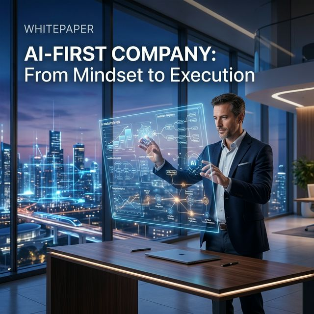

# 🚀 NickNguyen8 Training Portfolio

Welcome to the training portfolio of **NickNguyen8**, a **Tech Nomad** and AI consultant specializing in **AI-First Transitions**, **Agentic AI Workflows**, and **Digital Literacy**.

This repository serves as a centralized hub for training materials, curriculums, and research papers designed to empower individuals and organizations in the age of AI.

---

## 📂 Repository Structure

| Folder | Content | Description |
| :--- | :--- | :--- |
| [**`01-AI-Adoption/`**](./01-AI-Adoption-Program/) | AI Program | Enterprise-grade AI Adoption strategies and Whitepapers (EN/VN). |
| [**`02-AI-Maturity/`**](./02-AI-Maturity-Framework/) | Business Frameworks | Professional whitepapers and implementation kits for AI-First adoption. |
| [**`03-Agentic-AI/`**](./03-Agentic-AI-Workflows/) | Technical Workflows | Advanced training modules for AI agents, prompting, and automated workflows. |
| [**`Workshops/`**](./workshops/) | Session History | Agendas, handouts, and recordings from previous training sessions. |
| [**`Templates/`**](./templates/) | Reusable Kits | Syllabus templates, session checklists, and branding assets. |
| [**`Assets/`**](./assets/) | Visuals | Infographics, diagrams, and branding photography. |

---

## 🎯 Our Focus Areas

### 🏛️ 1. AI-First Maturity Framework

We help businesses transition from "AI-Enabled" to "**AI-First**." This involves structural changes, culture shifts, and strategic roadmap development.

- _Key Artifacts: [AI-First Whitepaper](./01-AI-Adoption-Program/documents/ai-first-company-v2-vn.md), [AI-Adoption-Program Roadmap](./02-AI-Maturity-Framework/AI-Adoption-Program.md)._

### 🤖 2. Agentic AI & Human-AI Collaboration

Training for the new era of software development and business operations using autonomous agents.

- _Key Artifacts: Agentic Workflow Design, Prompting for Agents, Multi-Agent Systems._

### 🌍 3. Digital Nomad & Tech Literacy

Bridging the gap between technology and a flexible lifestyle. Training for the modern workforce.

---

## 🛠️ Usage & Licensing

This repo is primarily for **showcasing**. Most materials are under a [Creative Commons License](./LICENSE) (Attribution-NonCommercial-ShareAlike).

---

**"A Tech Nomad in the AI Frontier."**
